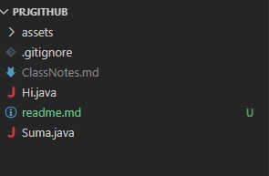

# Proyecto inicial

## estructura del proyecto

Proyecto/

│
├── assets/ # Recursos adicionales del proyecto
├── .gitignore # Archivos ignorados por Git
├── ClassNotes.md # Notas relacionadas con clases o conceptos
├── Hi.java # Programa simple de saludo
├── suma.java # Programa para realizar sumas
└── readme.md # Documentación del proyecto

***image***

